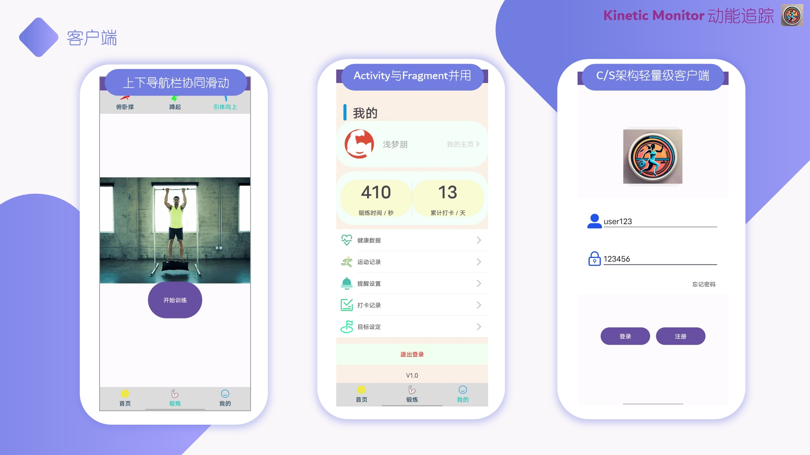
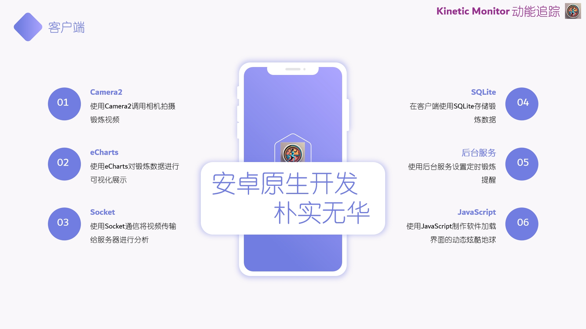
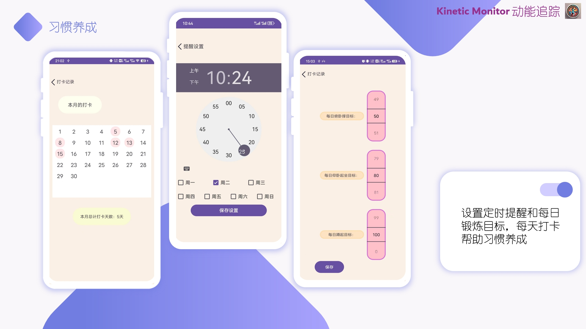
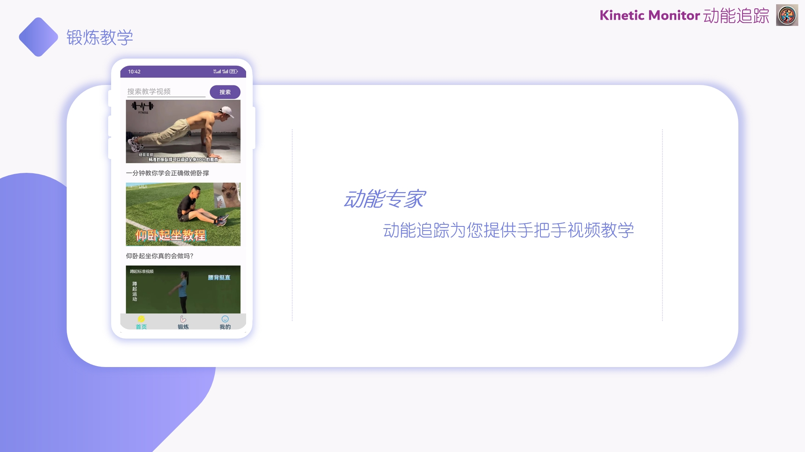
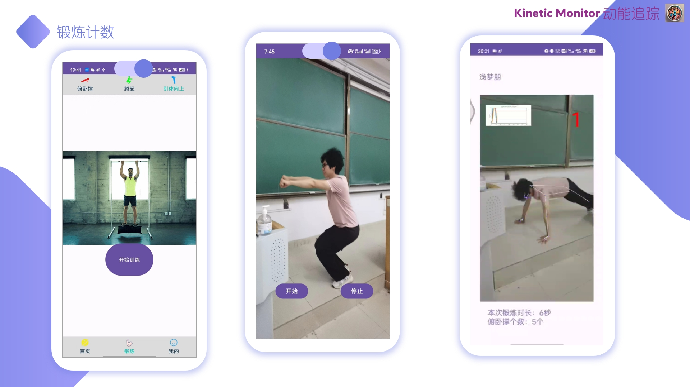
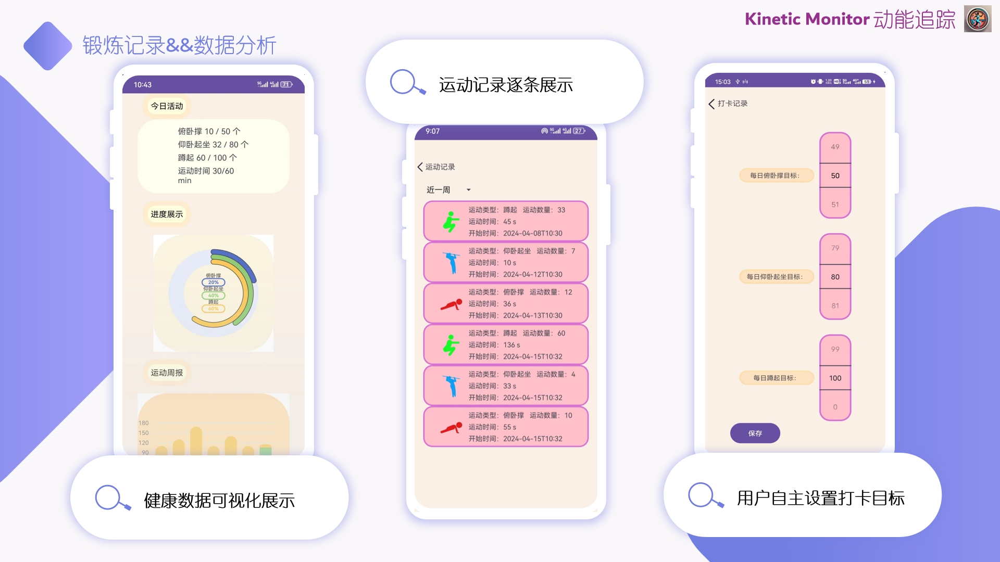
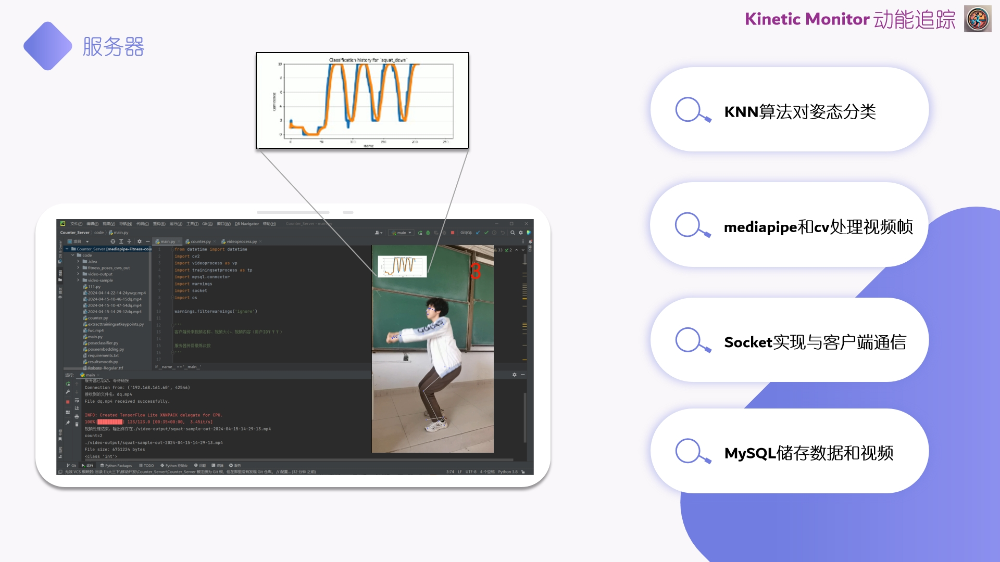

# Kinetic Monitor 动能追踪——室内锻炼辅助工具领跑者
听起来好厉害的名字，结果啥也不是，请做好往下看越来越失望的准备，dbq dbq dbq
## 河北工业大学计算机科学与技术专业移动应用开发大作业 By CKY and DYP

## APP功能简介
本APP为CS架构设计，目前仅为v1.0版本，可能后续有时间还会进一步完善，
当然，也欢迎广大在读大学生在我们项目基础上做增量开发（相信也只有期末想白嫖大作业的大学生会看看我们这学术垃圾了）\
我们的客户端设计有锻炼教学、锻炼记录与分析、数据分析、习惯养成四大模块，其中核心我们实现了
锻炼记录与分析、数据分析、习惯养成三大模块，客户端负责记录运动，并且保存个人锻炼数据等小容量数据，
服务器端负责接收客户端发来的记录视频，并进行计数，并且将视频信息存储到数据库中，
服务器使用MySQL数据库，分析完后的数据返回给客户端，客户端显示分析完带有标注的视频和数据。

客户端与服务器之间的通信我们当时因为没有很熟悉云服务器并且赶期末作业（懂得都懂），于是乎就直接用了Socket做CS之间的通信，
经过实际测试，发现效果还可以，挺快的，具体怎么跑通CS，相信学过计网的同学都知道哈，但是连校园网的注意了，河工大校园网是分段的，建议用热点。

服务器使用k-最近邻算法(k-NN) 作为分类器（该算法根据训练集中最接近的样本确定对象的类别），
而不是根据各运动的肢体之间的夹角特点作为分类依据，所以该方法具有良好的泛化通用能力，
可以广泛应用在诸如深蹲（deep squat）、俯卧撑（push up）、引体向上（pull up）等健身运动的计数上，
您只需要输入视频即可（或者如果您想使用自己采集的样本，只需要将训练样本图片更换成对应的运动即可）。

`class_name`需要与你的训练样本的两个动作状态图像文件夹的名字中的一个
（或者是与fitness_poses_csvs_out中的一个csv文件的名字）保持一致，它后面将用于分类时的索引。
具体是哪个动作文件夹的名字取决于你的运动是什么，例如：如果是深蹲（俯卧撑），
明显比较重要的判断计数动作是蹲下去（向下撑）；如果是引体向上，则判断计数的动作是向上拉到最高点的那个动作。

服务器是纯Python程序使用Pycharm开发，python>=3.6，客户端使用Android Studio，界面主要用xml画的，也用了一些JavaScript做了一些花里胡哨的东西，
服务语言使用Java。

如果想深入了解此项目可以联系邮箱：1104525089@qq.com，也可以直接加QQ交流。

# APP页面介绍
本人比较懒所以就直接把PPT的图截上来了，哈哈哈哈哈，PPT也附在项目中了，需要自取，但是请把你们帅气的董学长的蹲起图片删掉哈哈哈哈，我就懒得改了

点击这里观看[APP演示视频](https://meeting.tencent.com/cw/629EpJw2a6)（当时上课腾讯会议直播展示录的，
因为当时有点紧张， 第一次演示忘记开服务器了，尬住了，哈哈哈哈）

# -
# -
